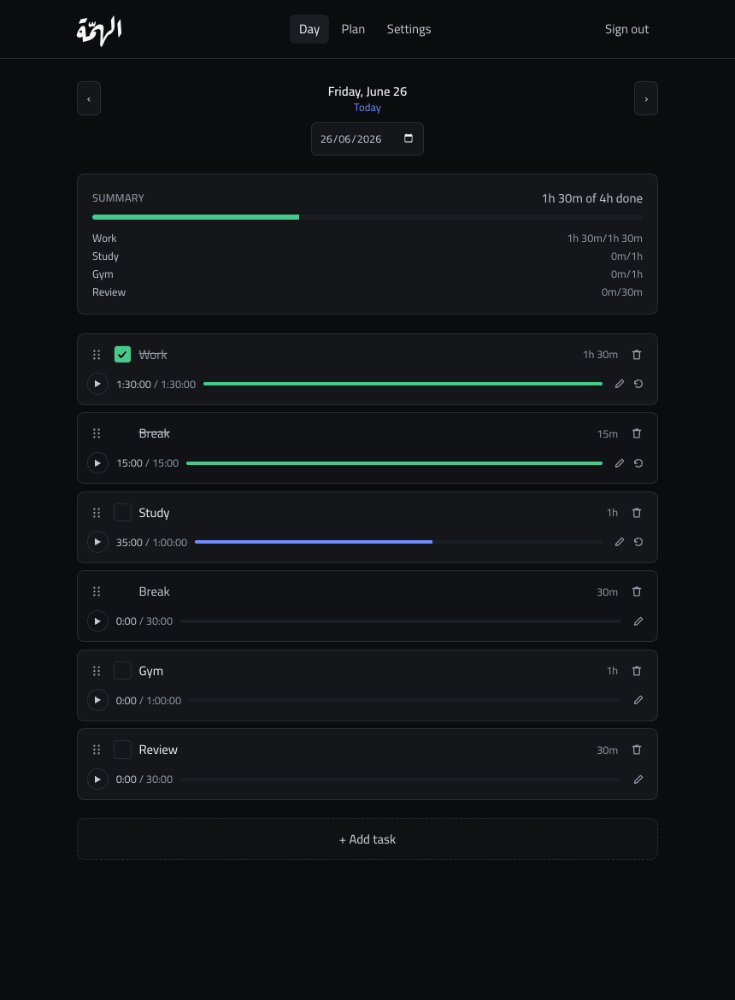

# Alhemmah (الهمّة)

A personal, bilingual (English / العربية) daily-schedule tracker. You hand-author a
fixed daily routine once; Alhemmah replays it every day, lets you time and check off
what you finish, and keeps an editable per-day history.



See [`CONTEXT.md`](./CONTEXT.md) for the domain glossary and
[`docs/adr/`](./docs/adr/) for architecture decisions.

## Features

- **Task types**, your source list: a label, a target total in hours, and weekdays to skip.
- **Schedule (template)**, a fixed, ordered list of work blocks (split as you like) and
  breaks. Drag to reorder. Edits apply to future days; past days keep their snapshot.
- **Day view**, today's checklist with a progress summary. Check blocks off, reorder for
  that day only, and add ad-hoc tasks (optionally promoting them into your standard day).
- **History**, jump to any date with the calendar or arrows; every day stays editable.
- **Settings**, switch language (full RTL in Arabic) and set your day-start hour
  (the rollover boundary, so late-night work still counts as the previous day).

## Stack

Next.js 16 (App Router) · Neon Postgres · Drizzle ORM · BetterAuth (email/password +
Google) · next-intl · Tailwind CSS v4. Authorization is enforced server-side, scoped by
`user_id`, see [ADR 0001](./docs/adr/0001-neon-drizzle-betterauth.md).

## Setup

This project uses **pnpm**.

### 1. Install

```bash
pnpm install
```

### 2. Environment

Copy the example and fill it in:

```bash
cp .env.example .env
```

- **`DATABASE_URL`**, create a project at [Neon](https://console.neon.tech) and copy the
  connection string.
- **`BETTER_AUTH_SECRET`**, generate one: `openssl rand -base64 32`.
- **`BETTER_AUTH_URL`**, `http://localhost:3000` in development.
- **`GOOGLE_CLIENT_ID` / `GOOGLE_CLIENT_SECRET`**, optional. Create an OAuth client at
  [Google Cloud Console](https://console.cloud.google.com) → Credentials → OAuth client ID
  (Web). Set the authorized redirect URI to
  `<BETTER_AUTH_URL>/api/auth/callback/google`. If left blank, the app runs with
  email/password only (the Google button is hidden).

### 3. Database

Apply the schema to your Neon database:

```bash
pnpm db:migrate
```

(Use `pnpm db:studio` to browse data, or `pnpm db:generate` after changing the
schema in `src/db/schema.ts`.)

### 4. Run

```bash
pnpm dev
```

Open [http://localhost:3000](http://localhost:3000), create an account, then build your
task types and schedule.

## Deploying to Vercel

Import the repo in Vercel, add the same environment variables, and deploy. Point
`BETTER_AUTH_URL` at your production URL and add the matching Google redirect URI. Run
`pnpm db:migrate` against your production database (e.g. locally with the production
`DATABASE_URL`) before first use.

## Scripts

| Script | Purpose |
| --- | --- |
| `pnpm dev` | Start the dev server |
| `pnpm build` / `pnpm start` | Production build / serve |
| `pnpm db:generate` | Generate SQL migrations from the schema |
| `pnpm db:migrate` | Apply migrations to the database |
| `pnpm db:push` | Push the schema directly (prototyping) |
| `pnpm db:studio` | Open Drizzle Studio |
